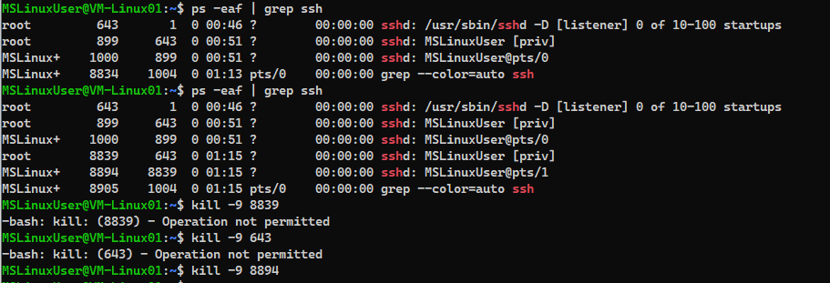

# git-commands
Comandos de git para clonacion y uso de repositorios
<table>
  <tr>
    <th>Comando</th>
    <th>Descripción</th>
  </tr>
  <tr>
    <td>git clone [URL]</td>
    <td>Clona un repositorio Git existente desde una URL remota.</td>
  </tr>
  <tr>
    <td>git add [archivo]</td>
    <td>Agrega cambios en el archivo especificado al área de preparación.</td>
  </tr>
  <tr>
    <td>git commit -m "[mensaje]"</td>
    <td>Crea un nuevo commit con los cambios en el área de preparación.</td>
  </tr>
  <tr>
    <td>git status</td>
    <td>Muestra el estado actual del repositorio.</td>
  </tr>
  <tr>
    <td>git pull</td>
    <td>Obtiene los cambios más recientes desde el repositorio remoto y los fusiona.</td>
  </tr>
  <tr>
    <td>git push</td>
    <td>Envía los commits locales al repositorio remoto.</td>
  </tr>
  <tr>
    <td>git branch</td>
    <td>Lista todas las ramas en el repositorio.</td>
  </tr>
  <tr>
    <td>git checkout [rama]</td>
    <td>Cambia a la rama especificada.</td>
  </tr>
  <tr>
    <td>git merge [rama]</td>
    <td>Fusiona los cambios de la rama especificada en la rama actual.</td>
  </tr>
  <tr>
    <td>git log</td>
    <td>Muestra un registro de commits en el repositorio.</td>
  </tr>
  <tr>
    <td>git reset [archivo]</td>
    <td>Retira el archivo especificado del área de preparación.</td>
  </tr>
</table>

<h2>Comandos Utilizados</h2>
<table>
  <tr>
    <th>Comando</th>
    <th>Descripción</th>
  </tr>
  <tr>
    <td>sudo apt update</td>
    <td>Actualiza la lista de paquetes disponibles</td>
  </tr>
  <tr>
    <td>sudo apt upgrade</td>
    <td>Actualiza los paquetes instalados a las versiones más recientes</td>
  </tr>
  <tr>
    <td>df -h</td>
    <td>Muestra el espacio disponible en el disco en un formato legible por humanos</td>
  </tr>
  <tr>
    <td>top</td>
    <td>Muestra información sobre los procesos en ejecución y su consumo de recursos</td>
  </tr>
  <tr>
    <td>netstat -tuanp</td>
    <td>Muestra información sobre las conexiones de red y los servicios que escuchan en los puertos</td>
  </tr>
  <tr>
    <td>sudo apt install net-tools</td>
    <td>Instala herramientas de red adicionales, como netstat, en el sistema</td>
  </tr>
  <tr>
    <td>ps -eaf | grep ssh</td>
    <td>Muestra los procesos en ejecución y filtra aquellos relacionados con SSH</td>
  </tr>
  <tr>
    <td>kill -9 (numero)</td>
    <td>Comando utilizado para enviar una señal a un proceso, por ejemplo, para detenerlo</td>
  </tr>
  <tr>
    <td>mysql --version</td>
    <td>Muestra la versión de MySQL instalada en el sistema</td>
  </tr>
  <tr>
    <td>sudo apt install mysql-server</td>
    <td>Instala el servidor MySQL en el sistema</td>
  </tr>
  <tr>
    <td>show databases,.</td>
    <td>Este comando muestra una lista de todas las bases de datos disponibles en el servidor MySQL al que estas conectando</td>
  </tr>

</table>

<h2>Comandos Sem 2 Clase 2</h2>
<table border="1">
  <tr>
    <th>Comando</th>
    <th>Descripción</th>
  </tr>
  <tr>
    <td><code>vi</code></td>
    <td>Abre el editor de texto Vi.</td>
  </tr>
  <tr>
    <td><code>i</code></td>
    <td>En el modo de inserción de Vi, permite insertar texto antes del cursor.</td>
  </tr>
  <tr>
    <td><code>vi</code></td>
    <td>Tecla 'esc' para salir del modo de inserción y volver al modo de comando en Vi.</td>
  </tr>
  <tr>
    <td><code>:wq!</code></td>
    <td>En el modo de comando de Vi, guarda los cambios y sale del editor sin preguntar si se han realizado cambios sin guardar.</td>
  </tr>
  <tr>
    <td><code>cat askfkasf.txt</code></td>
    <td>Muestra el contenido del archivo 'askfkasf.txt' en la terminal.</td>
  </tr>
  <tr>
    <td><code>echo "" > aafafas.txt</code></td>
    <td>Crea un archivo llamado 'aafafas.txt' si no existe, o trunca su contenido si ya existe, dejándolo vacío.</td>
  </tr>
  <tr>
    <td><code>sudo grep -R bind /etc/mysql</code></td>
    <td>Busca recursivamente la cadena "bind" en todos los archivos del directorio '/etc/mysql' utilizando el comando 'grep' con privilegios de superusuario ('sudo').</td>
  </tr>
  <tr>
    <td><code>cat /etc/mysql/mysql.conf.d/mysqld.cnf | grep bind</code></td>
    <td>Muestra las líneas del archivo '/etc/mysql/mysql.conf.d/mysqld.cnf' que contienen la cadena "bind" utilizando el comando 'grep' junto con 'cat'.</td>
  </tr>
</table>

<h2>Otros Comandos Importantes</h2>
<table>
  <tr>
    <th>Comando</th>
    <th>Descripción</th>
  </tr>
  <tr>
    <td>ls</td>
    <td>Listar archivos y directorios en el directorio actual</td>
  </tr>
  <tr>
    <td>grep</td>
    <td>Buscar texto dentro de archivos o la salida de otros comandos</td>
  </tr>
  <tr>
    <td>ps</td>
    <td>Mostrar los procesos en ejecución en el sistema</td>
  </tr>
  <tr>
    <td>chmod</td>
    <td>Cambiar los permisos de los archivos y directorios</td>
  </tr>
  <tr>
    <td>chown</td>
    <td>Cambiar el propietario y el grupo de archivos y directorios</td>
  </tr>
  <tr>
    <td>mkdir</td>
    <td>Crear un nuevo directorio</td>
  </tr>
  <tr>
    <td>rm</td>
    <td>Eliminar archivos o directorios</td>
  </tr>
  <tr>
    <td>mv</td>
    <td>Mover o renombrar archivos o directorios</td>
  </tr>
  <tr>
    <td>cp</td>
    <td>Copiar archivos o directorios</td>
  </tr>
  <tr>
    <td>cat</td>
    <td>Mostrar el contenido de un archivo</td>
  </tr>
</table>
